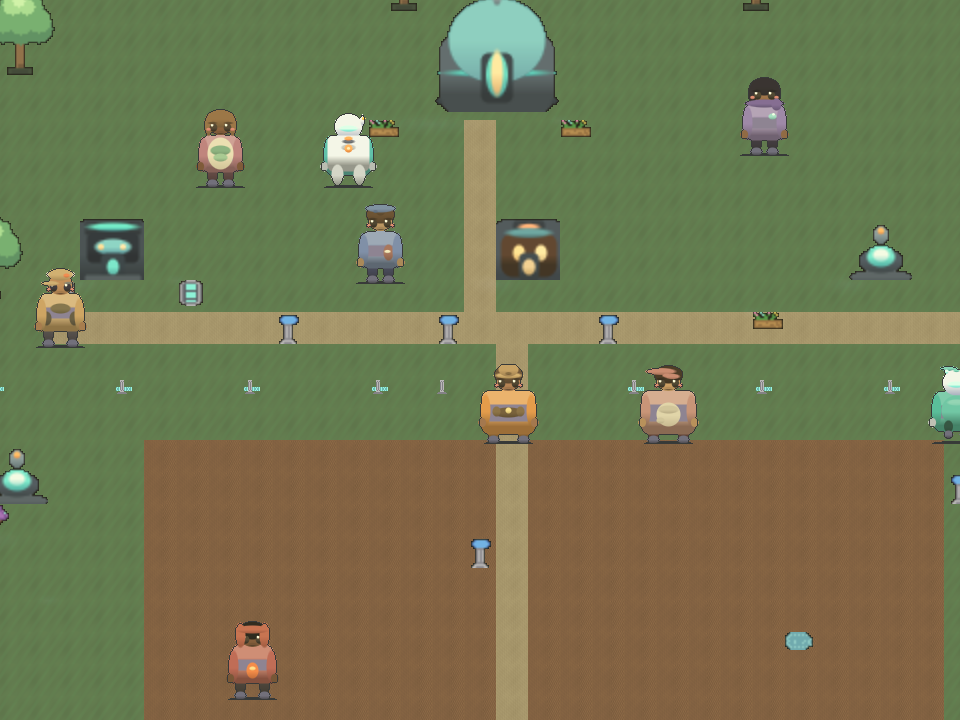

# Space Farmer

A cozy multiplayer farming game set on a remote asteroid—and a deterministic
reinforcement-learning environment backed by the same authoritative game rules.

The browser client is built with Phaser, multiplayer state is owned by
Colyseus, and the RL API drives the real server handlers without rendering or
network latency. Game agents and human players therefore operate against the
same economy, crops, seasons, quests, fishing, mining, ranching, and friendship
systems.

## Play locally

Requirements: Node.js 20 or newer.

~~~bash
npm ci
npm start
~~~

Open <http://localhost:8900>. The server hosts both the game and its WebSocket
endpoint. Saves live under the ignored local `saves/` directory.

Desktop controls:

- WASD or arrows: move
- Space/E: interact
- B: plant
- J: fish
- K: mine
- C: cook
- Tab: exchange
- I: shop
- L: colony log
- Touch controls appear automatically on mobile

## Why this is an RL environment

`rl/env_core.cjs` wraps the production `FarmRoom` directly. It provides:

- seeded deterministic episodes;
- 14 native action types;
- fixed-shape observations;
- action masks and a state-aware macro codec;
- reward and termination semantics;
- deterministic mid-episode checkpoints;
- parallel rollout workers;
- JSONL trajectory recording and exact replay;
- Gymnasium and MaskablePPO examples;
- optional OpenAI-compatible model policies.

Set up Python:

~~~bash
python3 -m venv .venv
. .venv/bin/activate
python -m pip install -r rl/python/requirements.txt
npm run test:python
npm run benchmark
~~~

The current deterministic baseline benchmark should show the economic policy
comfortably beating masked random play:

~~~text
policy       mean reward    mean credits
random            -5.767            61.7
economic           7.350          1281.7
~~~

Numbers above use three seeds and an eight-day horizon; use more seeds for
meaningful comparisons.

Train a masked PPO policy:

~~~bash
python -m pip install -r rl/python/requirements-train.txt
npm run train:ppo -- --timesteps 10000 --eval-episodes 5
~~~

Artifacts are written to the ignored `artifacts/` directory.

## Local-model rollouts

Any OpenAI-compatible chat endpoint can act as a policy. This matches the
gateway exposed by the sibling `ml-infra` project.

~~~bash
export OPENAI_BASE_URL=http://127.0.0.1:4000/v1
export OPENAI_API_KEY=sk-local
export OPENAI_MODEL=local-coder
python -m rl.python.rollout_llm --seed 42
~~~

The resulting `trajectories/llm-episode.jsonl` is replayed immediately to
prove that the recorded episode is deterministic.

## Verification

~~~bash
npm test                 # complete offline + live-network suite
npm run test:offline     # no listening socket
npm run test:rl          # Node environment smoke
npm run test:python      # Gym, bridge, vector, replay, and policy tests
npm run check:public     # public-tree/history and credential guard
~~~

The suite covers game mechanics, persistence, multiplayer presence, story,
NPC behavior, procedural sprites, deterministic checkpoints, Gymnasium,
parallel environments, and trajectory replay.

## Deploy

The server supports platform-provided `PORT` and `HOST`. The client discovers
the WebSocket endpoint from the page origin and automatically selects WSS under
HTTPS.

~~~bash
docker build -t space-farmer .
docker run --rm -p 8900:8900 -v space-farmer-saves:/app/saves space-farmer
~~~

See [ARCHITECTURE.md](ARCHITECTURE.md) for system boundaries and
[rl/python/README.md](rl/python/README.md) for the RL API.

## Project notes

All runtime character, terrain, building, and effect graphics are generated by
the source in `client/systems/SpriteSystem.js`. No game ROM or emulator is
required or included.

Space Farmer is released under the [ISC License](LICENSE).
